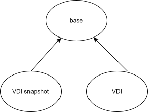

## Overview

The core idea of storage migration is surprisingly simple: We have VDIs attached to a VM, 
and we wish to migrate these VDIs from one SR to another. This necessarily requires 
us to copy the data stored in these VDIs over to the new SR, which can be a long-running 
process if there are gigabytes or even terabytes of them. We wish to minimise the 
down time of this process to allow the VM to keep running as much as possible.

This process is illustrated below. Conceptually there will be two hosts involved 
in this process: client -> server (local -> remote). Throughout this document, 
these two terms will be used interchangeably. The local host initiates the migration 
process, and moves the VDIs over to the server side. In practice these two hosts 
can be the same host, different hosts in the same pool (intra-pool), or different 
hosts on different pools (cross-pool). What counts as a storage migration is that we are 
moving from one SR to another.

Storage migration works as follows:
1. Take a snapshot of a VDI that is attached to VM1. This gives us an immutable 
copy of the current state of the VDI, with all the data until the point we took 
the snapshot. This is illustrated in the diagram as a VDI and its snapshot connecting 
to a shared parent, which stores the shared content for the snapshot and the writable 
VDI from which we took the snapshot. 
2. Mirror the writable VDI to the server hosts: this means that all writes that goes to the 
client VDI will also be written to the mirrored VDI on the remote host.
3. Copy the immutable snapshot from our local host to the remote. 
4. Compose the mirror and the snapshot to form a single VDI 
5. Destroy the snapshot on the local host

## Steps break down

### Preparation

Before we can start our migration process, there are a number of preparations 
needed to gather the information. In particular, the destination host needs to 
prepare the VDIs for mirroring. This is done by first looking for "similar" VDIs
in the destination SR, and if there are no such VDIs, create a new one. The similarity
metric is based on the `content_id` filed stored in each VDI.

### Mirror

- attach and activate the VDI to be mirrored to a special domain just for SXM
- keep track of the mirror with its id
  - A special table for tracking all the mirror tasks
- mirror the vdi
- (local) snaptshot the vdi
- copy the snapshot
- (remote) compose the mirror 
- (local) destroy the snapshot

The mirroring process itself, as it stands now, is unconventional, so it is worth
documenting how this works. Instead of a conventional client server architecture,
where the source client connects to the destination server directly through the
NBD protocol in tapdisk, the connection is established in xapi and then passed
onto tapdisk.

The diagram below illustrates this prcess. First, xapi on the source host will
initiate an http request to the remote xapi. This request contains the necessary
information about the VDI to be mirrored, and the SR that contains it, etc. This
information is then passed onto the http handler on the destination host (called
`nbd_handler`) which then processes this information. Now the unusual step is that
both the source and the destination xapi will pass this connection onto tapdisk,
by sending the fd representing the socket connection to the tapdisk process. On
the source this would be nbd client in the tapdisk process, and on the destination
this would be the nbd server in the tapdisk process. After this step, we can consider
a client-server connection is established between two tapdisks on the client and
server, as if the tapdisk on the source host makes a request to the tapdisk on the
destination host and initiates the connection. On the diagram, this is indicated 
by the dashed lines between the tapdisk processes. Logically, we can view this as
xapi creates the connection, and then passes this connection down into tapdisk.

### Snapshot

The next step would be create a snapshot of the VDI. This is easily done as a
`VDI.snapshot` operation. If the VDI was in VHD format, then internally this would
create two children for, one for the snapshot, which only contains the metadata
information and tends to be small, the other for the writable VDI where all the
new writes will go to. The shared base copy contains the shared blocks.

### Copy and compose

Once the snapshot is created, we can then copy the snapshot to from the source
to the destination. This step is done by `sparse_dd` using the nbd protocol. This
is also the step that takes the most time to complete.

Once copying is done, the snapshot and mirrored VDI can be then composed into a
single VDI.

### Finish

At this point the VDI is migrated to the new host! Mirror is still on at this point
though because that will not be destroyed until the VM itself has been migrated
as well. Some cleanups are done at this point, such as deleting the snapshot
that is taken on the source, etc. 

The end results look like the following. Note that VM2 is in dashed line as it
is not yet created yet. Creation of the new VM is part of the vm migration process,
which should be covered separately.

## Handling failures

Storage migration is a long-running process, and is prone to failures in each
step. Hence it is important specifying what errors could be raised at each step
and their significance. Thsi is beneficial both for the user and for triaging.

### Pre checks

### Mirror failure

### Copy failure

